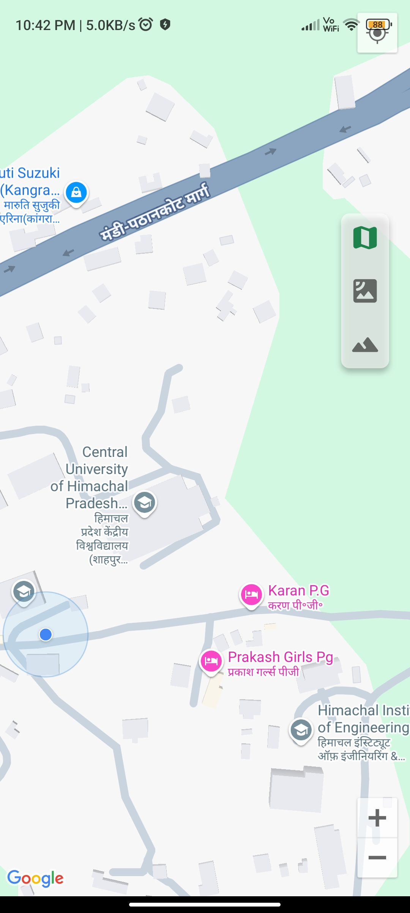

# CUHP PG or Room Finder - Flutter Application

## Description

This is the official Flutter mobile application for the CUHP PG or Room Finder platform. It allows users, primarily students and individuals around CUHP (Central University of Himachal Pradesh), to easily find and list PGs (Paying Guest accommodations) and rooms. The app provides a user-friendly interface to interact with the backend services, enabling features like property browsing, user authentication, real-time chat with property owners, and more.

This application serves as the client-side interface for the [CUHP PG or Room Finder API](https://github.com/miku272/cuhp_pg_or_room_finder_server).

## Features

-   **User Authentication:** Secure user registration, login, and session management. Includes OTP verification.
-   **Property Listings:** Browse, search, and filter available PGs and rooms with detailed information, images, and locations.
-   **Property Management (for Owners):** Allow property owners to list and manage their properties.
-   **Real-time Chat:** Integrated chat functionality using Socket.IO for seamless communication between property seekers and owners.
-   **Saved/Favorite Properties:** Users can save properties they are interested in for quick access later.
-   **Reviews and Ratings:** View and submit reviews and ratings for properties.
-   **Interactive Maps:** View property locations on Google Maps and search for properties based on location.
-   **Image Uploads:** Users can upload images for their property listings.
-   **User Profile Management:** Users can manage their profile information.
-   **Smooth User Experience:** Utilizes animations, loading indicators, and a clean UI for a pleasant user experience.

## Screenshots

Below are some representative screenshots of the application:

-   
-   
-   
-   
-   
-   
-   
-   
-   
-   
-   
-   
-   
-   

*(More screenshots can be found in the `assets/screenshots/` directory.)*

## Tech Stack & Key Dependencies

-   **Framework:** Flutter
-   **Programming Language:** Dart
-   **State Management:** `flutter_bloc`
-   **Navigation:** `go_router`
-   **HTTP Client:** `dio` (for communication with the backend API)
-   **Real-time Communication:** `socket_io_client` (for chat)
-   **Local Storage:** `shared_preferences`
-   **Mapping:** `google_maps_flutter`
-   **Location Services:** `geolocator`
-   **UI & UX:**
    -   `google_fonts` (custom fonts)
    -   `lottie` (animations)
    -   `carousel_slider` (image carousels)
    -   `cached_network_image` (efficient image loading)
    -   `shimmer` (loading placeholders)
    -   `flutter_rating_bar` (displaying ratings)
    -   `pinput` (OTP input fields)
-   **Image Handling:** `image_picker`, `image`
-   **Environment Variables:** `flutter_dotenv`
-   **Backend Integration:** Connects to a Node.js backend API. The server-side project can be found [here](https://github.com/miku272/cuhp_pg_or_room_finder_server).
    -   `supabase_flutter` is being used to store images.
-   **Utility:** `fpdart`, `get_it`, `intl`, `uuid`, `path`, `url_launcher`

## Prerequisites

-   Flutter SDK (check `pubspec.yaml` for specific Dart SDK version, e.g., `^3.5.4`)
-   An IDE like Android Studio or VS Code with Flutter and Dart plugins.
-   An emulator or a physical device to run the app.
-   Access to the backend API server. Ensure the API is running and accessible.

## Installation and Setup

1.  **Clone the repository:**
    ```bash
    git clone https://github.com/miku272/cuhp_pg_or_room_finder.git
    cd cuhp_pg_or_room_finder
    ```

2.  **Install Flutter dependencies:**
    ```bash
    flutter pub get
    ```

3.  **Set up Environment Variables:**
    Create a `.env` file in the root directory of the project. This file will store configuration settings, such as the API base URL. An example can be found at `assets/.env` or you can create one based on the following template.
    Example `.env` file:
    ```env
    API_BASE_URL=http://your_api_server_address:port
    GOOGLE_MAPS_API_KEY=your_google_maps_api_key

    SUPABASE_URL=your_supabase_url
    SUPABASE_ANON_KEY=your_supabase_anon_key
    ```
    *Ensure `.env` is listed in your `.gitignore` file to prevent committing sensitive keys.*

4.  **Configure Platform-Specific Settings (if any):**
    -   For Google Maps, ensure you have added your API key to the respective platform files (`android/app/src/main/AndroidManifest.xml` and `ios/Runner/AppDelegate.swift`).
    -   Follow any other platform-specific setup instructions for packages like `geolocator` or `image_picker`.

## Running the Application

### 1. Development Mode

-   Ensure an emulator is running or a device is connected.
-   Run the following command from the project root:
    ```bash
    flutter run
    ```

### 2. Building for Release

-   **Android:**
    ```bash
    flutter build apk --release
    # or for app bundle
    flutter build appbundle --release
    ```
-   **iOS:**
    ```bash
    flutter build ios --release
    ```
    (Requires a macOS machine with Xcode installed)

## Project Structure

```
cuhp_pg_or_room_finder/
├── android/                # Android specific files
├── ios/                    # iOS specific files
├── lib/                    # Main Dart source code
│   ├── main.dart           # Main application entry point
│   ├── init_dependencies.dart # Dependency injection setup (likely with get_it)
│   ├── router.dart         # Application routing configuration (with go_router)
│   ├── shell_scaffold.dart # Main app shell/scaffold if used
│   ├── core/               # Core utilities, constants, themes, error handling
│   │   ├── utils/
│   │   ├── theme/
│   │   └── constants/
│   ├── features/           # Feature-first structure (e.g., auth, property, chat)
│   │   ├── auth/
│   │   │   ├── presentation/
│   │   │   │   ├── bloc/   # BLoCs/Cubits for auth
│   │   │   │   └── widgets/ # UI widgets for auth screens
│   │   │   ├── data/       # Repositories, data sources for auth
│   │   │   └── domain/     # Use cases, entities for auth
│   │   ├── property/       # Similar structure for property feature
│   │   └── ...             # Other features
│   └── widgets/            # Common reusable widgets across features
├── assets/                 # Static assets like images, fonts, animations
│   ├── logo/
│   ├── icons/
│   ├── animations/
│   ├── loader/
│   └── .env                # Environment variable template (actual .env should be gitignored)
├── test/                   # Unit and widget tests
├── pubspec.yaml            # Project metadata and dependencies
└── README.md               # This file
```
*(The `lib/` structure is based on common Flutter best practices with BLoC and feature-first architecture.)*

## API Integration

This application relies on the **CUHP PG or Room Finder API** for its data and backend functionalities. Ensure the API server is running and the `API_BASE_URL` in the `.env` file and the `backendUri` in the `lib/core/constants/constants.dart` is correctly configured to point to the server. The server-side project and its documentation (including API endpoints and server-side Socket.IO events) can be found [here](https://github.com/miku272/cuhp_pg_or_room_finder_server).

Key interactions with the API include:
-   User authentication (login, registration, OTP)
-   Fetching, creating, updating, and deleting property data
-   Managing images for properties
-   Sending and receiving chat messages (via Socket.IO)
-   Managing reviews and ratings
-   Handling saved/favorite properties
-   User profile updates

## Socket.IO Client Events

The application uses `socket_io_client` to communicate with the backend for real-time chat. Key events the client listens for and emits are:

### Listening (Client-side Handlers for Server Emits)

-   **`connect`**: Standard event, triggered when the client successfully connects to the Socket.IO server.
-   **`disconnect`**: Standard event, triggered when the client disconnects from the server.
-   **`new_message`**: Received when a new message is sent in a chat room the user is part of.
    -   Expected Payload: `{ chatId: string, content: string, sender: { _id: string, name: string, avatar?: string }, createdAt: string, readBy: string[] }` (Confirm exact payload with server)
-   **`user_typing`**: Received when another user in the current chat starts typing.
    -   Expected Payload: `{ chatId: string, userId: string, isTyping: true }`
-   **`user_stopped_typing`**: Received when another user in the current chat stops typing.
    -   Expected Payload: `{ chatId: string, userId: string, isTyping: false }`
-   **`messages_read`**: Confirmation from the server that messages have been marked as read.
    -   Expected Payload: `{ chatId: string, userId: string, messageIds: string[] }`
-   **`chat_error` or `error`**: Custom event for chat-related errors from the server (e.g., failed to send message, not authorized for chat).
    -   Expected Payload: `{ message: string, details?: any }` (Confirm exact payload)
-   **`connect_error`**: Standard event for when the initial connection to the server fails.
    -   Payload: (Error object)

### Emitting (Client-side Emits to Server)

-   **`authenticate` or `join_server` (on connection)**: Typically, after connection, the client might need to send its token to authenticate the socket session.
    -   Expected Payload: `{ token: string }` (Confirm event name and payload with server)
-   **`join_chat`**: Emitted when a user opens a specific chat screen to join the corresponding room.
    -   Expected Payload: `{ chatId: string }`
-   **`send_message`**: Emitted when the user sends a new message.
    -   Expected Payload: `{ chatId: string, content: string }` (Server usually infers `senderId` from authenticated socket)
-   **`typing_indicator_start`**: Emitted when the current user starts typing in a chat.
    -   Expected Payload: `{ chatId: string }` (Server infers `userId` from socket)
-   **`typing_indicator_stop`**: Emitted when the current user stops typing.
    -   Expected Payload: `{ chatId: string }` (Server infers `userId` from socket)
-   **`mark_as_read`**: Emitted when the user has read messages in a chat.
    -   Expected Payload: `{ chatId: string, messageIds: string[] }` (Server infers `userId` from socket)

*(Note: The exact event names and payloads should be confirmed by checking the server-side Socket.IO implementation in the [CUHP PG or Room Finder API](https://github.com/miku272/cuhp_pg_or_room_finder_server) project.)*

## Contributing

Pull requests are welcome. For major changes, please open an issue first to discuss what you would like to change. Please make sure to update tests as appropriate.

1.  Fork the Project
2.  Create your Feature Branch (`git checkout -b feature/AmazingFeature`)
3.  Commit your Changes (`git commit -m 'Add some AmazingFeature'`)
4.  Push to the Branch (`git push origin feature/AmazingFeature`)
5.  Open a Pull Request

## License

ISC License

Copyright (c) 2024 Naresh Sharma

Permission to use, copy, modify, and/or distribute this software for any
purpose with or without fee is hereby granted, provided that the above
copyright notice and this permission notice appear in all copies.

THE SOFTWARE IS PROVIDED "AS IS" AND THE AUTHOR DISCLAIMS ALL WARRANTIES
WITH REGARD TO THIS SOFTWARE INCLUDING ALL IMPLIED WARRANTIES OF
MERCHANTABILITY AND FITNESS. IN NO EVENT SHALL THE AUTHOR BE LIABLE FOR
ANY SPECIAL, DIRECT, INDIRECT, OR CONSEQUENTIAL DAMAGES OR ANY DAMAGES
WHATSOEVER RESULTING FROM LOSS OF USE, DATA OR PROFITS, WHETHER IN AN
ACTION OF CONTRACT, NEGLIGENCE OR OTHER TORTIOUS ACTION, ARISING OUT OF
OR IN CONNECTION WITH THE USE OR PERFORMANCE OF THIS SOFTWARE.

---